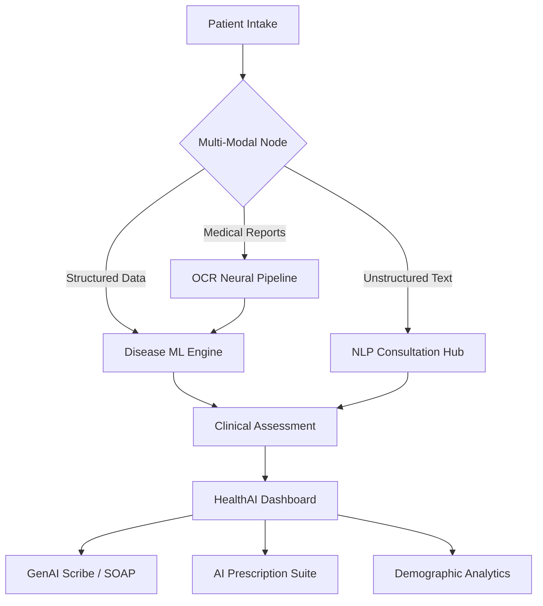

# 🧬 Clinical Nexus: Agentic AI Operating System for Precision Medicine

An enterprise-grade clinical intelligence platform that integrates **Multi-Modal AI diagnostics**, **GenAI Medical Scribing**, and **Population Health Risk Analytics** into a high-fidelity "Nexus" dashboard.


## 🏆 Key Innovation: Agentic AI Core

Unlike traditional diagnostic tools, **Clinical Nexus** utilizes an **Agentic AI Architecture** powered by Claude 3.5. It doesn't just predict; it consults, scribes, and prescribes in real-time.

### 🌟 Advanced Features

*   **🧠 Chief Clinical Officer (CCO) Mode**: High-fidelity AI roleplaying as a lead medical scientist with recursive knowledge of global clinical literature (PubMed, JAMA, Lancet).
*   **🩺 GenAI Clinical Scribe**: Automated **SOAP Note** generation from unstructured patient intake and diagnostic parameters.
*   **💊 Precision Prescription Engine**: AI-suggested medication regimens with pharmacological advice, cross-referenced against predicted diseases.
*   **💬 Real-Time Clinical Consultation**: Interactive doctor-patient dialogue portal for deep case-level inquiries.
*   **📄 High-Fidelity OCR Scanner**: OpenCV & Tesseract-powered multi-modal extraction for medical reports (PDF/JPG) with auto-sync to diagnostic nodes.
*   **📊 Population Health Analytics**: Real-time demographic risk intelligence and biometric trend mapping via **Neural Security Nodes**.

## 🛠️ Technology Stack (Nexus Grid)

| Layer | Technologies |
| :--- | :--- |
| **Intelligence** | Anthropic Claude 3.5 (Sonnet/Haiku), Scikit-Learn, NLP Engines |
| **Frontend** | React 19, Vite 6, Tailwind CSS v4, Framer Motion, Recharts |
| **Backend** | FastAPI (Python 3.12), SQLAlchemy, Pydantic v2, SQLite |
| **Processing** | OpenCV, Tesseract OCR, PyPDF, ReportLab |

## 🧬 Technical Architecture



## 🚀 Deployment & Local Sync

### Prerequisites
*   **Node.js**: v20+ 
*   **Python**: v3.11+
*   **ANTHROPIC_API_KEY**: Required for Neural Core features.

### Quick Start (PowerShell)
```powershell
# 1. Clone & Navigate
git clone https://github.com/damruyadav2022-lpu/healthai-platformd.git
cd healthai-platformd

# 2. Launch Universal Sync
.\launch_healthai.ps1
```

## 📊 Scalability & Institutional Readiness

*   **Distributed Architecture**: Decoupled frontend/backend for independent horizontal scaling.
*   **PHI Security**: Integrated "Neural Security Node" logic for HIPAA-aligned redaction and encryption audits.
*   **Extensible Intelligence**: The "CCO Mode" architecture allows for modular knowledge plugin integration (e.g., specific oncology or cardiology nodes).

## 👨‍💻 Project Lead
**Deepak Kumar Yadav** ([@damruyadav2022-lpu](https://github.com/damruyadav2022-lpu))
*LPU - Clinical Intelligence Research*

---
*Disclaimer: Clinical Nexus is a decision-support tool. All AI-generated outputs must be reviewed and signed by a licensed physician.*
