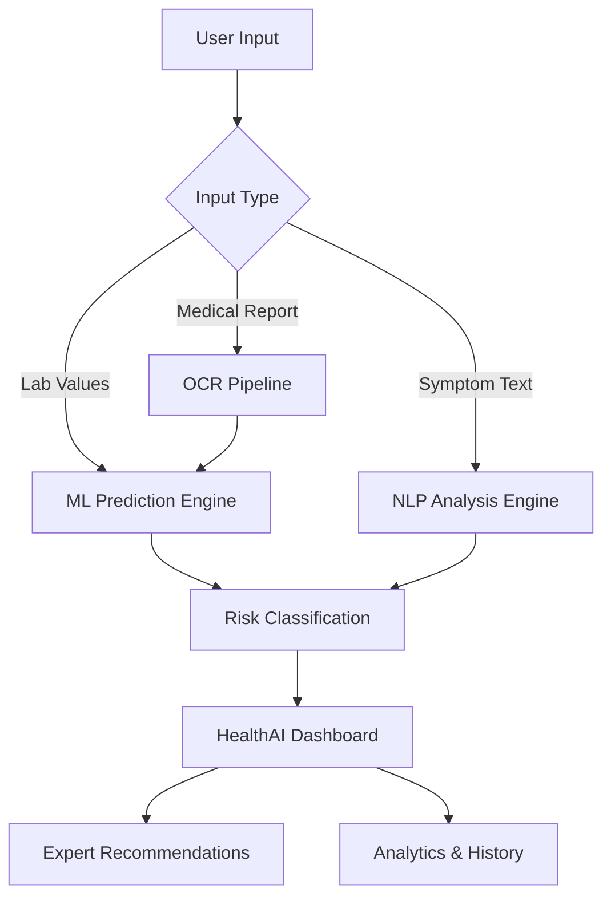

# 🏥 HealthAI Platform: Enterprise Medical Intelligence

An advanced, full-stack AI healthcare analytics system designed for disease prediction, clinical symptom analysis, and automated medical report interpretation. Built for scalability, precision, and ease of use.


## 🚀 Key Features

*   **🧠 Multi-Disease AI Prediction**: Real-time Machine Learning models for high-accuracy detection of **Diabetes, Heart Disease, and Liver Disease** via clinical parameters.
*   **💬 NLP Symptom Analysis**: Intelligent symptom matching against a clinical database of **100+ diseases**, mapping natural language input to potential conditions.
*   **📄 OCR Medical Scanner**: Automated extraction of lab values from reports (PDF/JPG) using Tesseract OCR and OpenCV, integrated directly into the prediction engine.
*   **📊 Dynamic Clinical Analytics**: High-performance, interactive data visualizations using Recharts, providing biometric trend tracking and risk gauging.
*   **📚 Searchable Knowledge Base**: A comprehensive medical dictionary of symptoms, recommended specialists, and precautionary measures.
*   **🤖 Integrated HealthBot**: A context-aware chatbot for quick clinical inquiries and platform navigation assistance.

## 🛠️ Technology Stack

| Layer | Technologies |
| :--- | :--- |
| **Frontend** | React 19, Vite, Tailwind CSS v4, Framer Motion, Lucide Icons, Recharts |
| **Backend** | FastAPI (Python 3.11), SQLAlchemy, Pydantic v2, SQLite |
| **AI/ML** | Scikit-Learn, Joblib, NLTK, NumPy, Pandas |
| **Image Processing** | Tesseract OCR, OpenCV (cv2) |
| **Infrastructure** | Docker, Nginx, GitHub Actions |

## 📐 Technical Workflow



## 📦 Getting Started

### 1. Prerequisites
*   **Node.js**: v18+
*   **Python**: v3.9+
*   **Tesseract OCR**: Required for the report scanner.

### 2. Installation

**Clone the repository:**
```bash
git clone https://github.com/damruyadav2022-lpu/healthai-platformd.git
cd healthai-platformd
```

**Backend Setup:**
```bash
cd backend
python -m venv venv
source venv/bin/activate # or venv\Scripts\activate on Windows
pip install -r requirements.txt
python run.py
```

**Frontend Setup:**
```bash
cd ../frontend
npm install
npm run dev
```

## 📈 Scalability & Innovation

*   **Modular Architecture**: Separate Frontend/Backend services for independent scaling.
*   **Hybrid Diagnostic Engine**: Combines structured ML models with unstructured NLP analysis for a 360° patient view.
*   **Real-time Processing**: Sub-second prediction latency ensuring a "pro" user experience.

## 📜 License
This project is licensed under the MIT License - see the [LICENSE](LICENSE) file for details.

## 👨‍💻 Created By
**Deepak Kumar Yadav** ([@damruyadav2022-lpu](https://github.com/damruyadav2022-lpu))
